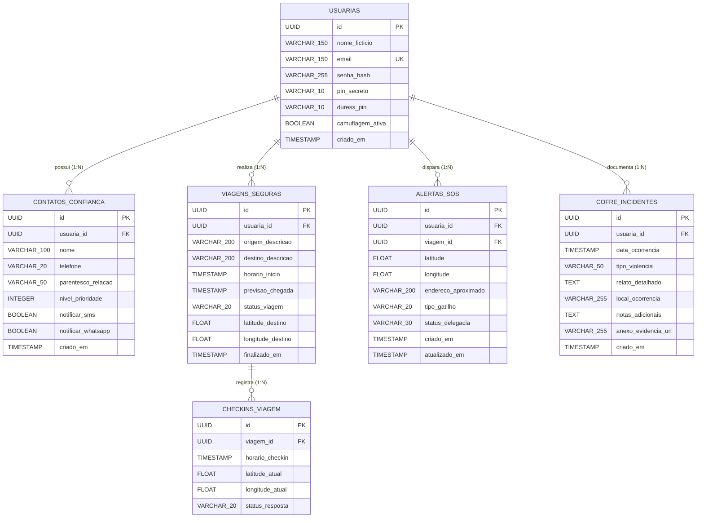

# 🗄️ Modelagem de Dados e Diagrama Entidade-Relacionamento (DER)

**Projeto Integrador:** Pratô / SAFE  
**Banco de Dados:** PostgreSQL  

---

## 1. Diagrama Entidade-Relacionamento (Mermaid)

---

## 2. Dicionário de Dados e Especificação das Tabelas

### 👤 Tabela 1: `usuarias` *(Responsável: Alana Caled)*
* **`id`**: `UUID`, Chave Primária (PK), gerado automaticamente (`DEFAULT gen_random_uuid()`).
* **`nome_ficticio`**: `VARCHAR(150)`, NOT NULL (nome de teste para exibição sigilosa).
* **`email`**: `VARCHAR(150)`, NOT NULL, Único (UK).
* **`senha_hash`**: `VARCHAR(255)`, NOT NULL (hash bcrypt da senha padrão).
* **`pin_secreto`**: `VARCHAR(10)`, NOT NULL (código de 4 a 6 dígitos de entrada no Pratô).
* **`duress_pin`**: `VARCHAR(10)`, NOT NULL (código de coação para envio silencioso de pânico).
* **`camuflagem_ativa`**: `BOOLEAN`, DEFAULT TRUE (ativa/desativa interface Pratô).
* **`criado_em`**: `TIMESTAMP`, DEFAULT CURRENT_TIMESTAMP.

---

### 👥 Tabela 2: `contatos_confianca` *(Responsável: Felipe Trindade)*
* **`id`**: `UUID`, Chave Primária (PK).
* **`usuaria_id`**: `UUID`, Chave Estrangeira (FK) referenciando `usuarias(id)` ON DELETE CASCADE.
* **`nome`**: `VARCHAR(100)`, NOT NULL.
* **`telefone`**: `VARCHAR(20)`, NOT NULL.
* **`parentesco_relacao`**: `VARCHAR(50)`, NOT NULL (ex: Mãe, Irmã, Amiga de Confiança).
* **`nivel_prioridade`**: `INTEGER`, NOT NULL (1 = Alta/Imediata, 2 = Média, 3 = Baixa).
* **`notificar_sms`**: `BOOLEAN`, DEFAULT TRUE.
* **`notificar_whatsapp`**: `BOOLEAN`, DEFAULT TRUE.
* **`criado_em`**: `TIMESTAMP`, DEFAULT CURRENT_TIMESTAMP.

---

### 🚗 Tabela 3: `viagens_seguras` & `checkins_viagem` *(Responsável: Higor Bueno)*
* **`id`**: `UUID`, Chave Primária (PK).
* **`usuaria_id`**: `UUID`, Chave Estrangeira (FK) referenciando `usuarias(id)` ON DELETE CASCADE.
* **`origem_descricao`**: `VARCHAR(200)`, NOT NULL (ex.: "Faculdade Positivo").
* **`destino_descricao`**: `VARCHAR(200)`, NOT NULL (ex.: "Casa").
* **`horario_inicio`**: `TIMESTAMP`, NOT NULL DEFAULT CURRENT_TIMESTAMP.
* **`previsao_chegada`**: `TIMESTAMP`, NOT NULL.
* **`status_viagem`**: `VARCHAR(20)`, NOT NULL DEFAULT 'EM_ANDAMENTO' (Valores: `EM_ANDAMENTO`, `CONCLUIDA_COM_SUCESSO`, `ATRASADA`, `SOS_ACIONADO`).
* **`latitude_destino`**: `FLOAT`, NULLABLE.
* **`longitude_destino`**: `FLOAT`, NULLABLE.
* **`finalizado_em`**: `TIMESTAMP`, NULLABLE.

---

### 🚨 Tabela 4: `alertas_sos` *(Responsável: Higor Domingos)*
* **`id`**: `UUID`, Chave Primária (PK).
* **`usuaria_id`**: `UUID`, Chave Estrangeira (FK) referenciando `usuarias(id)`.
* **`viagem_id`**: `UUID`, FK opcional referenciando `viagens_seguras(id)`.
* **`latitude`**: `FLOAT`, NOT NULL.
* **`longitude`**: `FLOAT`, NOT NULL.
* **`endereco_aproximado`**: `VARCHAR(200)`, NULLABLE.
* **`tipo_gatilho`**: `VARCHAR(20)`, NOT NULL (Valores: `BOTAO_DIRETO`, `DURESS_PIN`, `FALTA_CHECKIN`, `SHAKE`).
* **`status_delegacia`**: `VARCHAR(30)`, NOT NULL DEFAULT 'NOVO' (Valores: `NOVO`, `EM_ATENDIMENTO`, `CONCLUIDO`).
* **`criado_em`**: `TIMESTAMP`, NOT NULL DEFAULT CURRENT_TIMESTAMP.
* **`atualizado_em`**: `TIMESTAMP`, NOT NULL DEFAULT CURRENT_TIMESTAMP.

---

### 📁 Tabela 5: `cofre_incidentes` *(Responsável: João Pedro)*
* **`id`**: `UUID`, Chave Primária (PK).
* **`usuaria_id`**: `UUID`, Chave Estrangeira (FK) referenciando `usuarias(id)` ON DELETE CASCADE.
* **`data_ocorrencia`**: `TIMESTAMP`, NOT NULL.
* **`tipo_violencia`**: `VARCHAR(50)`, NOT NULL (Valores: `VERBAL_PSICOLOGICA`, `FISICA`, `PATRIMONIAL`, `VIRTUAL_PERSEGUICAO`).
* **`relato_detalhado`**: `TEXT`, NOT NULL.
* **`local_ocorrencia`**: `VARCHAR(255)`, NULLABLE.
* **`notas_adicionais`**: `TEXT`, NULLABLE.
* **`anexo_evidencia_url`**: `VARCHAR(255)`, NULLABLE (links simulados para fotos, áudios ou capturas de tela seguras).
* **`criado_em`**: `TIMESTAMP`, NOT NULL DEFAULT CURRENT_TIMESTAMP.
